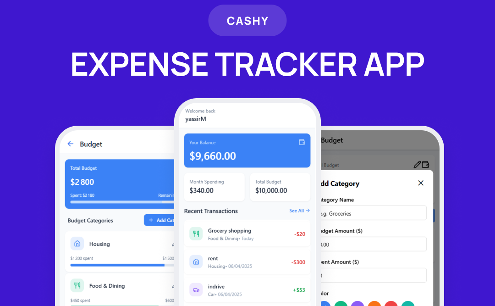

# CASHY Mobile App

  

A comprehensive personal finance management app built with React Native (frontend), Express.js (backend), and MongoDB (database). Track budgets, monitor transactions, and analyze spending habits seamlessly.

  

  

## Features

  
### 1. Home Screen

 - Displays total available balance and Highlights overall budget vs. total expenditures for the current month.

 - Lists the last 5 transactions with a quick "See All" button to view the entire history. 
 
- Welcomes users by name.

### 2. Budget Management

- Track budgets across categories.

- Visualize spent vs. remaining funds with progress indicators.

- Add/Edit custom budget categories.

  

### 3. Transaction Tracking

- Log income and expenses with categories and dates.

- View recent transactions with icons and warnings (⚠️).

- Salary deposits and recurring payments tracking.

  

### 5. Financial Analytics

- Monthly income vs. expense charts.

- Spending breakdown by category.

- Budget vs. actual spending comparisons.

  

### 5. User Profile

- Personal information management (username, email).

- Secure password updates and logout functionality.

  

## Tech Stack

  

**Frontend**

- React Native

- React Navigation

- Charting Library (Victory)

  

**Backend**

- Express.js

- MongoDB

- JWT Authentication

  

**Tools**

- Node.js
- Expo CLI

  
